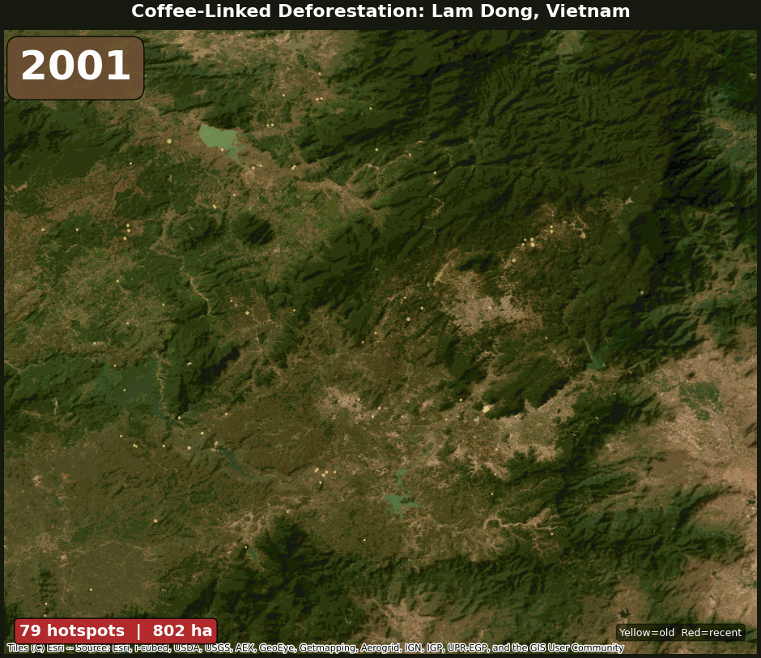

# Coffee Deforestation Monitoring System

Satellite-based detection of coffee-driven forest loss using Sentinel-1/2, Hansen GFC, ML classification, and LLM reporting.

**[View Reports & Interactive Maps](https://kieranmcgimsey.github.io/coffee-deforestation/)**



*Coffee-linked deforestation spreading across Vietnam's Central Highlands (2001–2024). Yellow = older, red = recent.*

---

## Contents

| | |
|---|---|
| **[Getting Started](documentation/getting-started.md)** | Installation, GEE setup, first pipeline run, troubleshooting |
| **[Methodology](documentation/methodology.md)** | Data sources, preprocessing, feature engineering, hotspot detection, ML, LLM reporting, validation |
| **[Extending the System](documentation/extending.md)** | Adding regions, scaling globally, improving ML, adapting for other commodities |
| **[Architecture](documentation/architecture.md)** | System design, data flow, caching, module responsibilities, testing strategy |

---

## Results

| Region | Forest Loss | Coffee % | Hotspots | ML F1 (cross-AOI) |
|--------|-------------|----------|----------|-------------------|
| **Lâm Đồng, Vietnam** (showcase) | 156,680 ha | 49% | 5,000 | 0.491 |
| **Huila, Colombia** (generalisation) | 72,313 ha | 55% | 5,000 | 0.483 |
| **Sul de Minas, Brazil** (control) | 94,227 ha | 32% | 5,000 | 0.625 |

Coffee dominates deforestation in Vietnam (49%) and Colombia (55%) but not in the Brazilian control (32%) — validating the pipeline's specificity. S1+S2 fusion outperforms either sensor alone (F1: 0.682 > 0.670 > 0.588).

## How It Works

```
Sentinel-2 + Sentinel-1 ──► 19-feature stack ──► RF/XGBoost classifier
                                                        │
Hansen GFC (loss) ──► Rule-based intersection ──────────┤──► Hotspot polygons
FDP (coffee prob) ──►                                   │──► Attribution analysis
WorldCover ─────────────────────────────────────────────┘──► Reports + Maps
```

1. **Composites**: Annual dry-season Sentinel-1/2 at 10m from GEE
2. **Features**: 19 bands — spectral indices, SAR, elevation, temporal change
3. **Hotspots**: Hansen loss ∩ FDP coffee > 50% → polygons with loss year
4. **Attribution**: ALL loss classified by replacement (coffee / crops / built / regrowth)
5. **ML**: Cross-AOI holdout, sensor ablation, feature importance
6. **Reports**: Interactive maps with year slider, attribution charts, LLM agents

See **[Methodology](documentation/methodology.md)** for full detail.

## Quick Start

```bash
conda create -n coffee-deforestation python=3.12 -y && conda activate coffee-deforestation
pip install uv && uv sync --extra dev
# Configure GEE auth (see documentation/getting-started.md)
uv run python scripts/validate_aois.py
uv run python scripts/run_aoi.py --aoi lam_dong
uv run python scripts/generate_maps.py
uv run python scripts/generate_report.py
```

See **[Getting Started](documentation/getting-started.md)** for detailed setup with troubleshooting.

## CLI Reference

| Script | Purpose |
|--------|---------|
| `validate_aois.py` | Check GEE auth and AOI validity |
| `run_aoi.py --aoi NAME` | Run pipeline for one AOI |
| `run_all.py` | All AOIs + ML training |
| `run_full_analysis.py` | Attribution + temporal analysis |
| `generate_maps.py` | Interactive maps with year slider |
| `generate_report.py` | Self-contained HTML reports |
| `generate_reports.py` | LLM reports (`--no-dry-run` for real Claude) |
| `query_hotspots.py` | Find hotspots near a point or by time period |
| `clear_cache.py` | Cache management |

## Known Limitations

- **No ground truth** — ML validated against proxy labels, not field surveys
- **FDP coverage gaps** — uneven globally; some regions have no coffee predictions
- **Cross-region ML is weak** — F1 0.48-0.63; region-specific retraining needed
- **Hansen 12-18 month lag** — not near-real-time; pair with GLAD/RADD alerts
- **Classification at 300m** — GEE download limits; maps show full 10m

Full analysis in **[Methodology → Validation](documentation/methodology.md#validation)**.

## Adding a New Region

```yaml
# config/aois.yaml
sidama:
  name: "Sidama Zone"
  country: "Ethiopia"
  coffee_type: "Arabica, wild"
  role: "East African expansion test"
  bbox: {west: 38.0, south: 6.0, east: 39.0, north: 7.0}
  dry_season: {start_month: 10, end_month: 2, cross_year: true}
```

```bash
uv run python scripts/run_aoi.py --aoi sidama
```

UTM zone is auto-computed. See **[Extending → Adding a New Region](documentation/extending.md#adding-a-new-region)** for the full guide.

## Project Structure

```
config/              AOI definitions + pipeline parameters
src/coffee_deforestation/
  data/              GEE client, S1/S2 composites, ancillary layers
  features/          Indices, SAR features, contextual, stack assembly
  change/            Hansen overlay, hotspots, attribution, temporal
  ml/                Labels, training, prediction, evaluation
  stats/             Pydantic schemas, summary builder
  reporting/         LLM client, 3 agents, 6 tools, factcheck
  viz/               Theme, static figures, interactive maps
scripts/             CLI entry points (typer-based)
notebooks/           4 Jupyter notebooks with outputs
documentation/       Detailed guides (methodology, extending, architecture)
tests/               211 tests (69% coverage)
```

## License

MIT. FDP data is CC-BY-4.0-NC; outputs using FDP-derived layers inherit NC restrictions.
